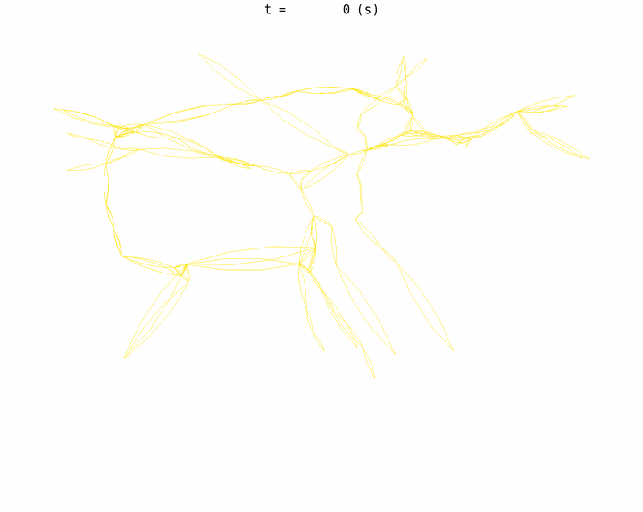

# traffic

Ein Ansatz zur Effizienzsteigerung des Verkehrsstaus im öffentlichen Strassenverkehr in der Stadt Zürich unter Verwendung von **Deep Reinforcement-QLearning Networks** (DRQN).

## Statische Simulation

In dieser Simulation werden die Ampeln 60 Sekungen periodisch auf die nächste Stufe geschalten. Man sieht sehr schnell dass sich Stau bildet bei welchem man sich als Fahrer in keine Richtung mehr bewegen kann. Dieses Phänomen nennt man "Gridlock". Stau zeichnet sich durch "dunkle" & "dicke" Linien aus.

## DRQN Simulation

In dieser Simulation werden mit der gleichen Anzahl Fahrzeuge, dynamisch-geschaltete Ampeln getestet. Die Ampeln schalten nicht mehr periodisch auf die nächste Stufe sondern durch die KI gesteuert.

## Statistik

todo